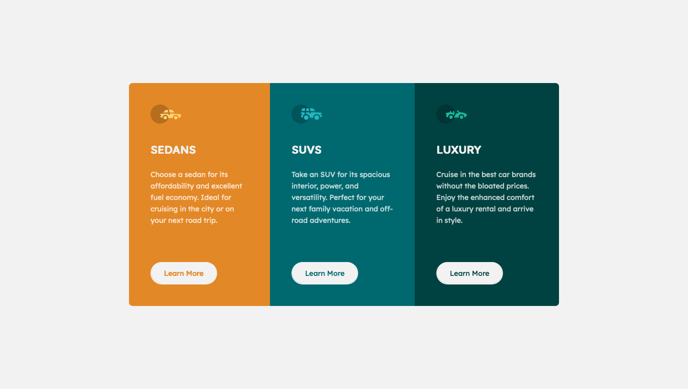

# 3-column preview card component solution

## Table of contents

- [Overview](#overview)
  - [The challenge](#the-challenge)
  - [Screenshot](#screenshot)
  - [Links](#links)
- [My process](#my-process)
  - [Built with](#built-with)
  - [What I learned](#what-i-learned)
  - [Continued development](#continued-development)
  - [Useful resources](#useful-resources)
- [Author](#author)

## Overview

### The challenge

Users should be able to:

- View the optimal layout depending on their device's screen size
- See hover states for interactive elements

### Screenshot



### Links

- Live Site URL: [Live Site](https://mystifying-darwin-346328.netlify.app/)

## My process

### Built with

- Semantic HTML5 markup
- CSS custom properties
- Flexbox
- Mobile-first workflow

### What I learned

This project taught me mobile-first workflow is quick, easy, and efficient. I reset all the margins on the page and added my own. I use the wildcard selector to do this. There's a little trick displayed below that allows you to add a class called "flow" and where ever that class is added it selects all its children and adds a margin-top to them. Giving you more control of spacing on your page. I also added a variable to the first input and a fallback. So it always gives a margin-top of 1em standard. If I want, I can simply change the variable on the root selector and it impacts the whole page. It's really neat! 🪄

```css
h2,
p {
  margin: 0;
}

.flow > * + * {
  margin-top: var(--flow-space, 1em);
}
```

### Continued development

I want to keep driving home flexbox. I didn't get the chance to use it much in this project. I want to get flexbox down before I move to grid.

### Useful resources

- [.flow selector trick](https://www.youtube.com/watch?v=qKiz9gdJdr8&feature=youtu.be) - This helped me with clearing margins and is where I got the .flow selector trick shown above.

## Author

- Frontend Mentor - [@yourusername](https://www.frontendmentor.io/profile/afewfirstnames)
